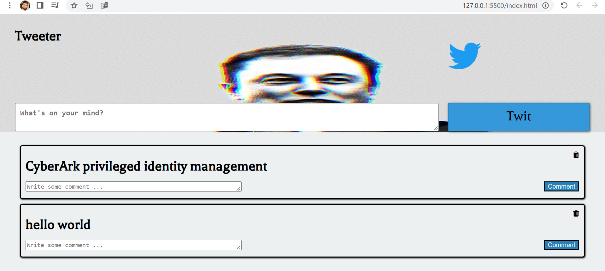
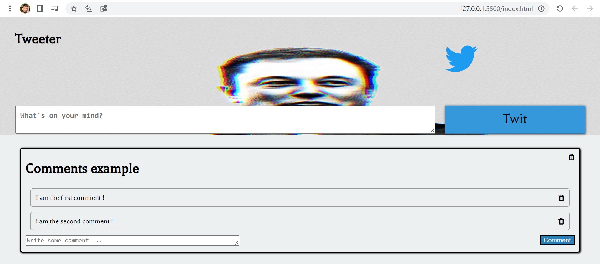

"# tweeter-submittion" 

# Contents

- [Overview](#overview-)
- [Technologies](#technologies-)
- [ScreenShots](#ScreenShots-)
- [Videos](#videos-)

 

# Overview 👋

Project number 1 -
Create twitter page, base on VANILLA JS (with JQUERY), HTML, CSS.
Implemntation based on MVC.

 

# Game Description

quizrave is a web game -
Quiz with 10 questions, you can set the difficulty level in the settings.

# Technologies 👨‍💻

# Screenshots 🎮

 

 

# Video 🎥

Please click on image to see the video.

